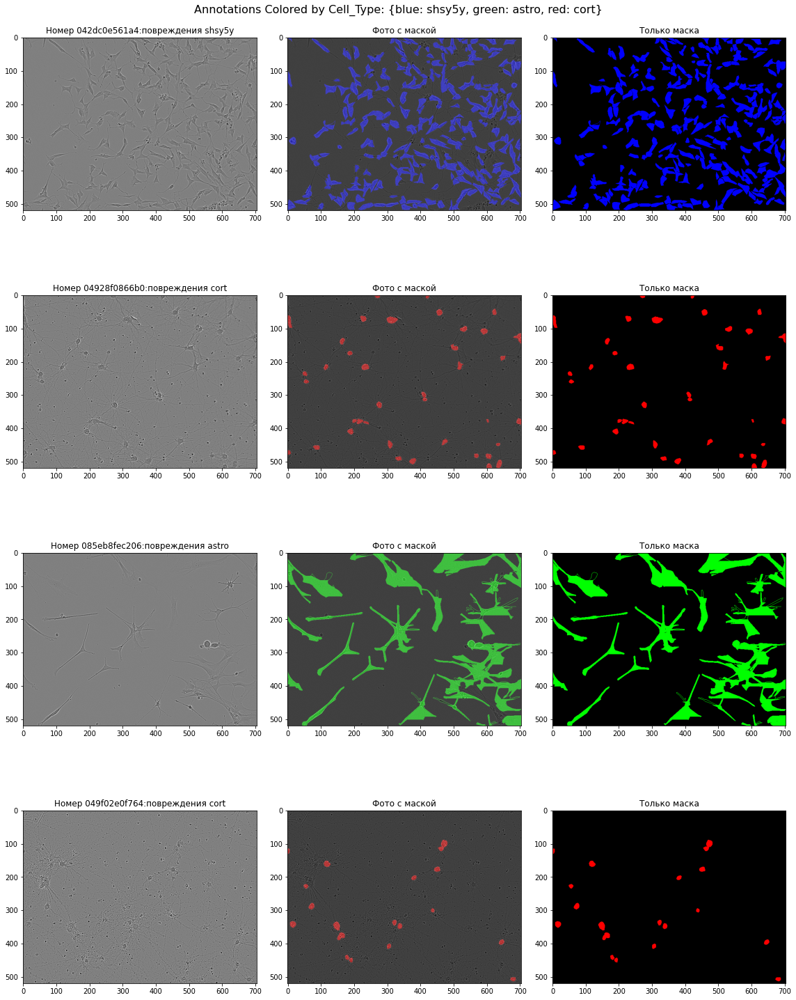
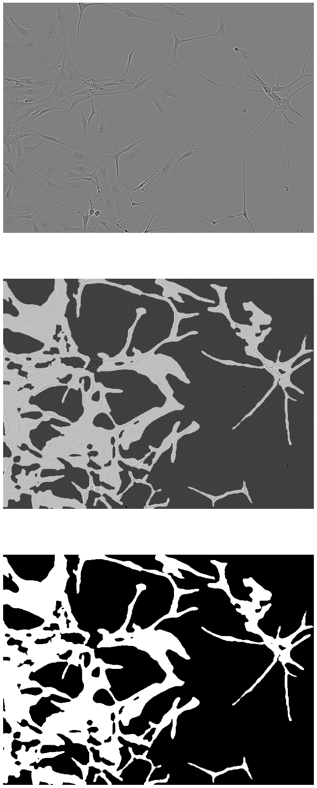
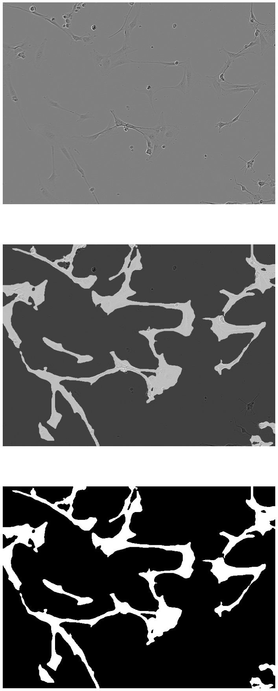
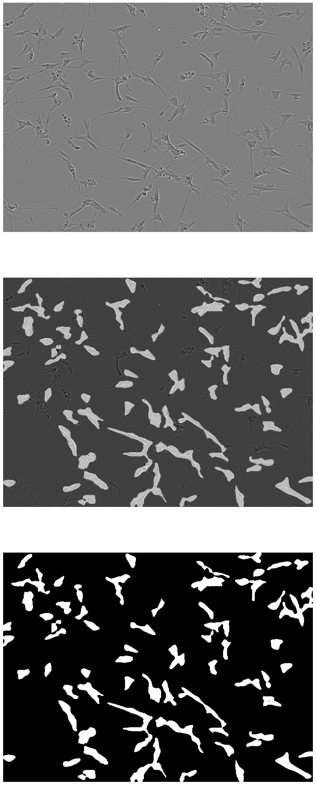

mask-neuron-sartorius
==============================
[](https://colab.research.google.com/drive/1HMek3df0dpPOH4Njl5z6soCUIlN5-GRi?usp=sharing)

[ [English](./docs/README.eng.md) ]

## Sartorius
Всем привет. Это моё первое решение kaggle competition.
Этот репозитории представляет собой решение одного [kaggle competition](https://www.kaggle.com/competitions/sartorius-cell-instance-segmentation/overview). Конкретнее Sartorius — Сегментация экземпляра ячейки. В соревновании предстоит находить маски нейронов со снимков. В снимках показаны нейроны при болезни Альцгеймера разделённые на три класса (Целые, Поврежденные, Деградировавшие).Сами снимки были получены с помощью световой микроскопии, которая одновременно доступна и неинвазивна. Текущее решение в компании имеет ограниченную точность из-за своеобразной формы нейрона. Ваше решение может помочь привести к открытию новых и эффективных лекарств для лечения миллионов людей с этими расстройствами.




## Как установить

### make

Для установки dataset вам понадобиться kaggle api token(kaggle.json). Токен нужно поместить в директорию проекта в дальнейшем он будет перенесён в домашнюю директорию пользователя для работы с kaggle api. Или же вы можете лично скачать [dataset](https://www.kaggle.com/competitions/sartorius-cell-instance-segmentation/data) и распоковать его в ./data . В Makefile пропустите цель data (make data).

```sh
make
```

Так же можно последовательно запустит нужные инструкции из Makefile

Создаём виртуальную среду python
```sh
make venv
```

Скачиваем dataset
```sh
make data
```

Удаляем ненужные файлы
```sh
make clean
```

Обучаем модель
```sh
make train
```

### Windows

Создаём виртуальную среду python
```sh
python -m venv ./venv & venv\Scripts\activate.bat & pip install -r requirements.txt
```

Скачиваем dataset
```sh
python src/data/make_dataset.py
```

Обучаем модель
```sh
cd ./src/models & python train_model.py & cd ../../
```

## Решение:
Полная визуальная статистика и информация о Dataset представлена в ноутбуке (.src/visual/)
Для решения я решил взять готовую модель resnet34 и файнтюнить её. Для обучение вы можете использовать как GPU, так и CPU (по умолчанию используется GPU). На выходе мы получили нейросеть способную находит маску нейронов изображенных на снимках. Вот примеры тестовых неразмеченных снимков.


--------------------------



### Организация проекта


	├── Makefile       	<- Makefile с такими командами, как `make data` или `make train``
	├── README.md      	<- README верхнего уровня для разработчиков, использующих этот проект.
	├── data           	<- Данные используемые в проекте
	│
	├── docs           	<- Дополнительная информация о проекте(диаграммы, графики, презентации)
	│
	├── models         	<- Обученные и сериализованные модели
	│
	├── notebooks      	<- Jupyter notebooks.
	│
	├── requirements.txt   <- Файл требований для воспроизведения среды анализа.
	│
	├── src            	<- Исходный код для использования в этом проекте.
	│   ├── __init__.py	<- Делает src модулем Python
	│   │
	│   ├── data       	<- Скрипты для загрузки или генерации данных
	│   │   └── make_dataset.py
	│   │
	│   │
	│   ├── models     	<- Скрипты для обучения моделей и последующего использования обученных моделей для создания
	│   │   │
	│   │   └── train_model.py
	│   │
	│   └── visualization  <- Скрипты для создания исследовательских и ориентированных на результат визуализаций
	│   	└── dataset_analytics.ipynb
	│
	└── test_env.py    	<- Делает проект pip устанавливаемым (pip install -e .), чтобы можно было импортировать src


--------

<p><small>Project based on the <a target="_blank" href="https://drivendata.github.io/cookiecutter-data-science/">cookiecutter data science project template</a>. #cookiecutterdatascience</small></p>
