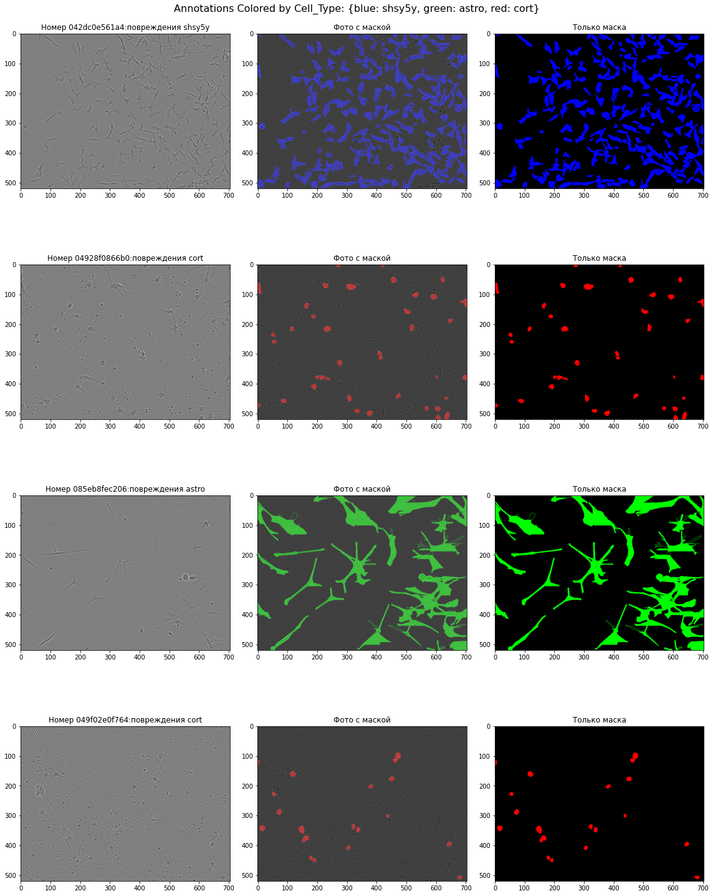
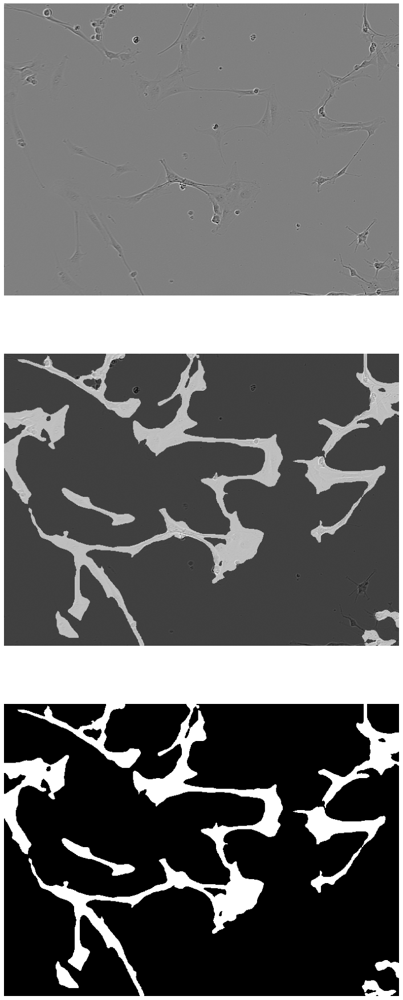
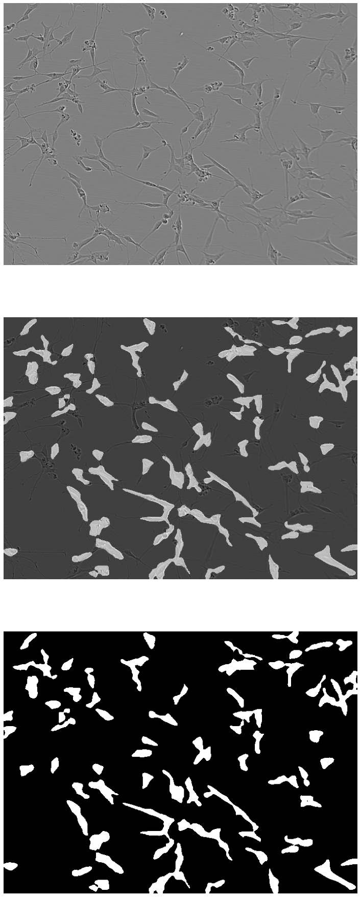

mask-neuron-sartorius
==============================
[](https://colab.research.google.com/drive/1HMek3df0dpPOH4Njl5z6soCUIlN5-GRi?usp=sharing)

[[Russian](../README.md) ]

## Sartorius
Hi everybody. This is my first kaggle competition solution.
This repository is a solution to one [kaggle contest](https://www.kaggle.com/competitions/sartorius-cell-instance-segmentation/overview). More specifically Sartorius - Segmentation of a cell instance. The competition is to find neuron masks from snapshots. The images show Alzheimer's disease neurons divided into three classes (Whole, Damaged, Degraded).The images themselves were obtained using light microscopy, which is both affordable and non-invasive. The company's current solution has limited accuracy due to the peculiar shape of the neuron. Your solution could help lead to the discovery of new and effective drugs to treat millions of people with these disorders.




## How to install

### make

To install dataset you will need a kaggle api token(kaggle.json). The token must be placed in the project directory, and then it will be moved to the user's home directory to work with the kaggle api. Or you can personally download [dataset](https://www.kaggle.com/competitions/sartorius-cell-instance-segmentation/data) and unpack it into ./data . In the Makefile skip the target data (make data).

```sh
make
```
You can also execute the instructions you want from the Makefile one by one.

Create a virtual python environment
```sh
make venv
```

Download dataset
```sh
make data
```

Delete unnecessary files
```sh
make clean
```

Train the model
```sh
make train
```

### Windows

Create a virtual python environment
```sh
python -m venv ./venv & venv\Scripts\activate.bat & pip install -r requirements.txt
```

Download dataset
```sh
python src/data/make_dataset.py
```

Train the model
```sh
cd ./src/models & python train_model.py & cd ../
```

## Solution:
Full visual statistics and Dataset information is provided in the notebook (.src/visual/)
For the solution, I decided to take the finished resnet34 model and firetune it. You can use both GPU and CPU for training (by default GPU is used). The output was a neural network capable of finding a mask of neurons depicted in the images. Here are some examples of test unmasked images.





### Project Organization

    ├── Makefile           <- Makefile with commands like `make data` or `make train`
    ├── README.md          <- The top-level README for developers using this project.
    ├── data               <- Data used in the project
    │
    ├── docs               <- Additional information about the project (diagrams, graphs, presentations)
    │
    ├── models             <- Trained and serialized models
    │
    ├── notebooks          <- Jupyter notebooks.
    │
    │
    ├── requirements.txt   <- The requirements file for reproducing the analysis environment.
    │
    ├── src                <- Source code for use in this project.
    │   ├── __init__.py    <- Makes src a Python module
    │   │
    │   ├── data           <- Scripts to download or generate data
    │   │   └── make_dataset.py
    │   │
    │   │
    │   ├── models         <- Scripts to train models and then use trained models to make
    │   │   │                 predictions
    │   │   └── train_model.py
    │   │
    │   └── visualization  <- Scripts to create exploratory and results oriented visualizations
    │       └── dataset_analytics.ipynb
    │
    └── test_env.py        <- makes project pip installable (pip install -e .) so src can be imported


--------

<p><small>Project based on the <a target="_blank" href="https://drivendata.github.io/cookiecutter-data-science/">cookiecutter data science project template</a>. #cookiecutterdatascience</small></p>
